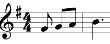

# Introduction to coding with Python

_These are class notes_ for a group of elememtary and middle school students who have learned fundamentals of programming and are comfortable with the Scratch block-based programming language. They learned using Google's CSFirst platform.

We meet 1h/week, have minimal homework, and are starting by loosely following the textbook [Python for Kids](https://www.amazon.com/Python-Kids-Playful-Introduction-Programming/dp/1593274076). The primary goal is for the students to have fun. The curriculum will be guided by student interests.

### Lesson 1: 

<details>
  <summary>Details</summary>

- From Scratch to Python
- Introduction to the Python console
- Operators +,-,*,/,>,<
- Numbers and Strings
- Variables  
- Lists
- Subsetting lists

**class notes / code snpippets:** [lesson_1.py](https://github.com/dlebauer/intro-python/blob/master/lesson_1.py)

**Homework:** Use variables and operators to solve one of your homework problems
</details>


### Lesson 2: 

* Introducing IDEs
* lists, print, string substitution
* for loops, indexing
* class notes / code snpippets: [lesson_2.py](https://github.com/dlebauer/intro-python/blob/master/lesson_2.py)

<details>
  <summary>Homework</summary>

- Use a list, a for loop, and operators to solve the following:

On Monday you find a goose that lays diamond eggs. It lays the first egg that day, and you take it to a jewelery store. The owner says it is worth 3 million dollars! On Tuesday you find out that it lays one egg per day. Write a for loop program that tells you how much many diamonds you will have on Tuesday, Wednesday, Thursday, and Friday and how much they will be worth. Specifically, write a loop that prints the following output:

```python
On Tuesday you have 2 eggs worth 3 million dollars
On Wednesday you have 2 eggs worth 6 million dollars
On Thursday you have 3 eggs worth 9 million dollars
On Friday you have 4 eggs worth 12 million dollars
```

Hint: see the [lesson 2 notes](https://github.com/dlebauer/intro-python/blob/master/lesson_2.py)

</details>

### Lesson 3: Dictionaries and vectors

<details>
  <summary>Details</summary>

- review homework
  - solve homework w/ dictionaries
  - create vectors eggs and value
  - plot eggs vs value
- draw pictures with turtles

</details>

## Lesson 4: Finding and using images

<details>
  <summary>Details</summary>

- control the screen size
- images: 
   - find and download using google image search
   - create and export using google drawings
   - import into trinket
- add background image and change turtle image https://trinket.io/python/041c755b35

</details>

## Lesson 5: writing functions, controlling turtle with arrow keys
- how to write a function
- control the turtle with up/down/left/right keys https://trinket.io/python/89f11c3faf


## Lesson 6: Getting started with Games!

- install IDE on your computer
- start learning pgzero

<details>
  <summary>Homework</summary>

Homework

- Create a new project in PyCharm or Spyder 
- save this image in a folder named 'images/' https://pygame-zero.readthedocs.io/en/stable/_images/alien.png
- cut and paste this into your file named main.py :  https://raw.githubusercontent.com/dlebauer/intro-python/master/lesson_6_alien_run.py
- Run the game. Try to click on the alien and see what happens.

Answer the following questions:
  1. what does += mean?
  2. how does the alien get from the left side to the right side?
  3. how does the alien get back from the right side to the left side?
  4. how can you make the alien say 'Eek!'?
</details>

## Lesson 7: Sounds and Color

Today we continued working through the pgzero tutorials - and learned how to get the alien to make a sound 

<details>
  <summary>Details</summary>

Here is the code from the end of today's lesson that includes the sound response, red background, and following functionality: https://github.com/dlebauer/intro-python/blob/master/lesson_7_alien_eep.py 

Answers to questions in todays class:

1. What is that IDE some students were using that looked so much easier to use than PyCharm or Spyder?
  - I just learned about this last week - it is called 'Mu' and it is designed specifically to make it easier to learn (by hiding all of the fancy stuff that PyCharm and Spyder offer). It is pre-configured for learning with pgzero!!!
  - You can download it from https://codewith.mu/
2. How to change the background color?
  - add `screen.fill((255, 87, 51))` to turn the background red
  - The three numbers `(255, 87, 51)` refer to the red, green, and blue content on a scale of 0-255. 
     - You can find the three numbers required for any particular by googling "color picker" https://www.google.com/search?q=color+picker

3. How to have the alien chase the mouse?
   - Add `animate(alien, pos = pos, duration = 1, tween = 'bounce_end')` to the function `on_mouse_down`, e.g.:
   
```python
def on_mouse_down(pos):
    alien.angle = alien.angle_to(pos)
    animate(alien, pos = pos, duration = 1, tween = 'bounce_end')
    if alien.collidepoint(pos):
        set_alien_hurt()
    else:
        print("You missed me!")
```   

This will make the alien go to wherever you clicked. If you want the alien to always follow the mouse, you can add this function:

```
def on_mouse_move(pos):
    alien.angle = alien.angle_to(pos)
    animate(alien, pos = pos, duration = 1, tween = 'bounce_end')
```
</details>

### Lesson 8: Movement and animation

We continued with position and movement

Highlights:

* the `animate` function and learned about ["Inbetweening"](https://en.wikipedia.org/wiki/Inbetweening) - getting the sprite from point a to point b with flair
* moving the alien with the mouse: `on_mouse_move` and `on_mouse_click`

[Homework](https://github.com/dlebauer/intro-python/blob/master/lesson_8_homework.md)

### Lesson 9: Random movement

* review coordinate systems and speed
* control two sprites

<details>
  <summary>Details</summary>

* [Video](https://youtu.be/GrgXd7f-tfM)
* reviewed coordinates and speed
  * [background on cartesian and computer coordinate systems](https://fcs-cs.github.io/cs1-2018/modules/01-introduction/computer-coordinates/)
* control alien1 with arrows and alien2 with wasd keys
* Used of functions to separate control of aliens 1 and 2
  * [this code shows the first `update2` function](https://github.com/dlebauer/intro-python/blob/master/lesson_9_two_aliens.py)
* randomization
  * return alien to a random position on the left
  * randomize alien speed in X and Y
  * generate random colors
  * [here is the code!](https://github.com/dlebauer/intro-python/blob/master/lesson_9_random_position.py)

</details>


### Lesson 10: Gravity


* Review  [cartesian (math) vs computer coordinates](https://fcs-cs.github.io/cs1-2018/modules/01-introduction/computer-coordinates/)
* Learn how to program **gravity** is a fundamental component of platformer games. [`gravity.py` code from today](https://github.com/dlebauer/intro-python/blob/master/lesson_10_gravity.py)

* [Class notes](https://github.com/dlebauer/intro-python/blob/master/lesson_10_gravity.md) and 
* [Video](https://youtu.be/_n2BhygIrcs) 
* [homework](https://github.com/dlebauer/intro-python/blob/master/lesson_10_gravity.md#lesson-10-homework)


### Lesson 11 & 12: Music with [Sonic Pi](https://sonic-pi.net/)

Mixing things up with music. 
- learn a new language (Ruby)
- revisit familiar concepts (variables, loops, functions)
  - for loop example: [Carol of the Bells](https://github.com/dlebauer/intro-python/blob/master/lesson_12_carol_of_the_bells.rb)
  - functions and more: [Danny Boy Sandbox](https://github.com/dlebauer/intro-python/blob/master/lesson_12_danny_boy.rb)
- make music!!!


- defining a chord as a function 
<details>
  <summary>Details</summary>

 (note: Sonic Pi has a `chord` function, e.g. `play chord(:E3, :minor)` but here we are defining an ad-hoc chord)
```rb
# lets make a chord
define :dada do
  play :d3
  play :a3
  play :d2
  play :a2
  sleep 1
end

3.times do
  dada
end
```
</details>

- write out musical phrases:
<details>
  <summary>Details</summary>

Lets implement the first four notes from Danny Boy:



Here we will use the `play_pattern_timed` function

```rb
play_pattern_timed [:fs4, :g4, :a4, :b4],
    [0.5, 0.5, 0.5, 1.5]
```

Make it easier with variables to define the type (length) of the notes. Here we have three eighth (e) notes and one dotted quarter (dq)

```rb
e = 0.5
dq = 1.5
play_pattern_timed [:fs4, :g4, :a4, :b4],
    [e, e, e, dq]
```

See more in the [Danny Boy Sandbox](https://github.com/dlebauer/intro-python/blob/master/lesson_12_danny_boy.rb)

</details>

### Lesson n: Animating Sprites and Collisions


**Collisions** what happens when two sprites collide? what happens when they get close to each other?
* Lets find pgzero games on github and where to find new images and sounds
  * Three sources:
    * pgzero source code
    * https://opengameart.org/
    * google search --> images --> sprites 
  * put images in your 'images' directory
  * spritesheet unpacking, e.g. https://ezgif.com/sprite-cutter

### Lesson n+1: Animating sprites

### Future lessons

* CS skills
  * emphasizing functions
  * experimenting by combining what we know
* Python skills
  * importing functions from another file
  * finding answers in documentation
  * finding answers and using examples online
* Game components
  * change sprite size
  * changing background and blitting
  * [animating a sprite](http://www.penguintutor.com/projects/docs/pgzero-game-worksheet.pdf)
  * keep track of score
  * scrolling
  * The flappy bird game: https://pygame-zero.readthedocs.io/en/stable/from-scratch.html

## Resources and Further Reading 

### Python Editors

These are all designed for learning: 

* [trinket.io](https://trinket.io) This is web based, and comes pre-configured for use with Turtle and getting started with pgzero
* [Mu Editor](https://codewith.mu/en/download) 
* [PyCharm EDU](https://www.jetbrains.com/pycharm-edu/) has more features, more complicated but also more powerful.

There are many others - IDLE is installed with Python by default, and is very simple. Spyder is also a popular open source editor.

### Sonic Pi

* download with editor here: [Sonic Pi](https://sonic-pi.net/)
* has great built in documentation

### Tutorials and Examples

* Pygame Zero documentation: https://pygame-zero.readthedocs.io/en/stable/index.html
* [Example code for games](https://github.com/lordmauve/pgzero/tree/master/examples) in the Pgzero software source code
* Richard Smith "Coding Games With Pygame Zero & Python (2nd ed)" https://electronstudio.github.io/pygame-zero-book
* Coding Games in Python: A step by step visual guide to creating your own Python games" ([PDF](http://dl.booktolearn.com/ebooks2/computer/python/9781465473615_Coding_Games_in_Python_e382.pdf)) ([Amazon](https://www.amazon.com/Coding-Games-Python-DK/dp/1465473610))
* [Beginning Games Programming with Pygame Zero](http://www.penguintutor.com/projects/docs/pgzero-game-worksheet.pdf)
* Advanced (uses Pygame and classes, which aren't covered in this course)
  * [Code the Classics Vol 1](https://www.mclibre.org/descargar/docs/revistas/wireframe-books/wireframe-books-code-the-classics-en-201912.pdf)
